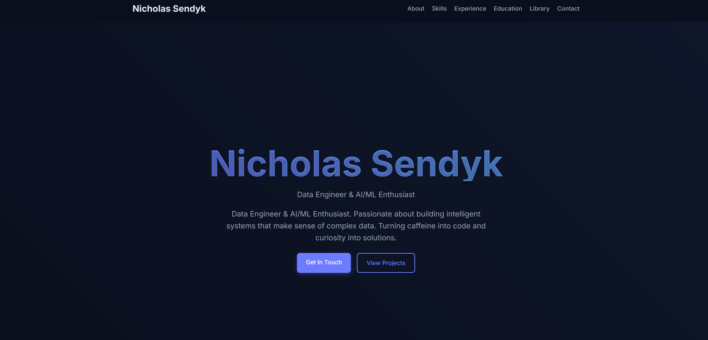

# Nicholas Sendyk - Personal Portfolio



A modern, responsive personal portfolio website built with Jekyll, showcasing my skills, experience, and projects as a Data Engineer & AI/ML Enthusiast.

## ✨ Features

- **Responsive Design**: Looks great on all devices from mobile to desktop
- **Dark Theme**: Easy on the eyes with a sophisticated dark color scheme
- **Interactive Elements**: Subtle animations and hover effects for an engaging experience
- **Modular Components**: Organized structure for easy updates and maintenance
- **Social Media Integration**: Quick access to professional profiles and contact information
- **Category Filtering**: Filter skills and technologies by category
- **Education & Certifications**: Showcase academic achievements and professional certifications
- **Work Timeline**: Visual representation of professional experience

## 🛠️ Technologies

- **Jekyll**: Static site generator
- **HTML5/CSS3**: Modern markup and styling
- **JavaScript**: Interactive elements and animations
- **Responsive Grid**: Flexible layout for all screen sizes
- **CSS Variables**: Theme customization and consistency
- **Media Queries**: Tailored experience for different devices
- **CSS Animations**: Subtle motion for enhanced user experience

## 🚀 Setup & Deployment

### Prerequisites

- Ruby (version 2.7.0 or newer)
- RubyGems
- Jekyll
- Bundler

### Local Development

1. Clone the repository:
   ```bash
   git clone https://github.com/nicholassend/portfolio.git
   cd portfolio
   ```

2. Install dependencies:
   ```bash
   bundle install
   ```

3. Run the development server:
   ```bash
   bundle exec jekyll serve
   ```

4. Open your browser and navigate to `http://localhost:4000`

### Folder Structure

```
portfolio/
├── _config.yml               # Site configuration
├── _data/                    # Data files (YAML)
│   ├── books.yml             # Favorite books information
│   ├── education.yml         # Education and certifications data
│   ├── experience.yml        # Work experience data
│   └── skills.yml            # Skills and technologies data
├── _includes/                # Reusable components
│   ├── about.html            # About section
│   ├── contact.html          # Contact section
│   ├── education.html        # Education section
│   ├── experience.html       # Experience section
│   ├── footer.html           # Page footer
│   ├── head.html             # HTML head content
│   ├── header.html           # Page header/navigation
│   ├── library.html          # Books/reading section
│   └── skills.html           # Skills section
├── _layouts/                 # Page layouts
│   ├── default.html          # Default layout
│   └── home.html             # Home page layout
├── assets/                   # Static assets
│   ├── css/                  # Stylesheets
│   ├── images/               # Images and photos
│   └── js/                   # JavaScript files
├── .gitignore                # Git ignore file
├── 404.html                  # 404 error page
├── Gemfile                   # Ruby dependencies
├── index.html                # Homepage
└── README.md                 # Project documentation
```

### Customization

The site is designed to be easily customizable:

1. **Personal Information**: Edit `_config.yml` to update name, email, social media links, etc.
2. **Content**: Modify files in the `_data` directory to update skills, experience, education, etc.
3. **Styling**: Customize the appearance by editing variables in `assets/css/main.css`
4. **Sections**: Add or remove sections by editing the layout files in `_includes`

## 📝 License

This project is licensed under the MIT License - see the [LICENSE](LICENSE) file for details.
---

Built with ❤️ in Ottawa, Canada | [View Live Site](https://nicholassend.github.io)
